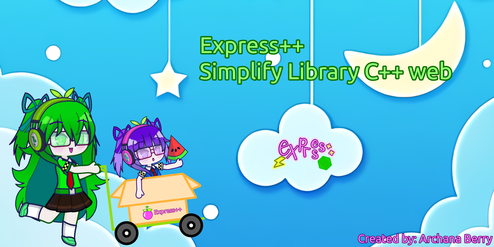

# ARCHANABERRY EXPRESS++



## Deskripsi
ArchanaBerry Express adalah library web minimalis tetapi fitur juga lengkap dan berbasis C++ yang mirip dengan Express.js di Node.js. Library ini memungkinkan Anda untuk membuat server web dengan mudah, menangani rute, dan mendukung multithreading. Dengan menggunakan Boost.Beast dan Boost.Asio, ArchanaBerry Express menawarkan kinerja yang tinggi dan fleksibilitas untuk pengembangan aplikasi web.

<br>
<br>
  
<br>
<br>
<br>
<br>
<br>
<br>
<br>
<br>
<br>
<br>
<br>
<br>
<br>
<br>
<br>
<br>
<br>
<br>
<br>
<br>

## Informasi
- **Penulis:** Archana Berry
- **Versi:** 1.0.0
- **Lisensi:** MIT
- **Bahasa:** C++
- **Dependencies:**
  - Boost.Beast
  - Boost.Asio
  - Boost.System
  - Boost.Thread

## Cara Pakai
1. **Instalasi Boost Library**
   Pastikan Boost library yang mencakup Boost.Beast dan Boost.Asio sudah terinstal di sistem Anda. Anda dapat menginstal Boost library menggunakan manajer paket sistem atau mengunduh dan mengkompilasinya dari situs resmi Boost.

2. **Kompilasi dan Menjalankan Server**
   Buat file `main.cpp`, `archanaberry.hpp`, dan `archanaberry.cpp` dengan konten seperti yang dijelaskan sebelumnya. Kemudian kompilasi dengan perintah berikut (contoh untuk g++):

   ```bash
   g++ -o nama_app nama_webbapp.cpp berry_express.cpp -lboost_system -lboost_thread -lpthread
   ```

   Jalankan server dengan perintah:

   ```bash
   ./nama_app
   ```

3. **Membuat Rute**
   Anda dapat membuat rute untuk menangani permintaan HTTP seperti contoh berikut:

   ```cpp
   #include "berry_express.hpp"

   int main() {
       archanaberry::express::AppWeb appweb("127.0.0.1", 8080);

       appweb.route("/", [](auto& req, auto& res) {
           res.body() = R"(
               <!DOCTYPE html>
               <html lang="en">
               <head>
                   <meta charset="UTF-8">
                   <meta name="viewport" content="width=device-width, initial-scale=1.0">
                   <title>Home</title>
                   <style>
                       body { font-family: Arial, sans-serif; }
                       h1 { color: #333; }
                   </style>
               </head>
               <body>
                   <h1>Welcome to the Home Page</h1>
                   <p>This is a minimalistic C++ web server.</p>
                   <script>
                       console.log("JavaScript is running.");
                   </script>
               </body>
               </html>
           )";
       });

       appweb.run();

       return 0;
   }
   ```

## Screenshot

*Gambar 1: Halaman Utama*


*Gambar 2: Konsol JavaScript*


*Gambar 3: Struktur Proyek*

## Status Fitur yang Akan Dikembangkan

| Fitur                      | Status          |
|----------------------------|-----------------|
| Routing dasar              | Selesai         |
| Dukungan multithreading    | Selesai         |
| Dekomposisi HTML/CSS/JS    | Selesai         |
| Middleware                 | Dalam Pengembangan |
| Pengelolaan Static Files   | Dalam Pengembangan |
| Template Engine            | Akan Datang     |
| Pengelolaan Session/Cookie | Akan Datang     |
| Dokumentasi Lengkap        | Akan Datang     |
| Contoh Proyek              | Akan Datang     |

## Kontribusi
Kami sangat terbuka untuk kontribusi dari komunitas. Silakan buat pull request atau buka isu baru di repositori GitHub kami jika Anda menemukan bug atau memiliki fitur yang ingin ditambahkan.

## Lisensi
Proyek ini dilisensikan di bawah lisensi MIT. Lihat file [LICENSE](LICENSE) untuk informasi lebih lanjut.